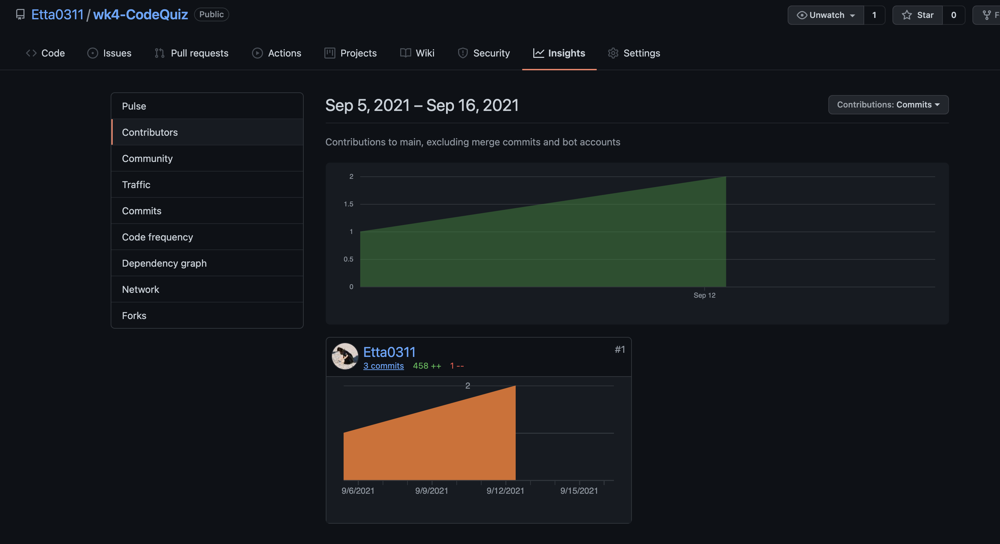

<<<<<<< HEAD
# wk4-CodeQuiz

Link: [Codequiz](https://etta0311.github.io/wk4-CodeQuiz/)

## Description

In this task, I am asked to create a code quiz from scratch. By using HTML,CSS and Javascript,
a simple quiz template was built and work smoothly.
THis work mainly focused on how to make javascript content to work to link up with classes & ids.
Techniques like timer countdown, links to another html to display highscore rank.
It's a tough task that requires lots of efforts and time to get it concept clear in mind, but yet it teaches so much
Improvements still needed for further usage.

## Table of Contents

   - Techniques used
   - Usage
   - Credits
   - License

## Techniques used

   - Elements Such as header, footer, sections, asides etc. in html
   - setting Style with CSS file
   - Javascript for running quiz and display questions

## Usage


## Contributors



## Credits
    - https://coding-boot-camp.github.io/full-stack/github/professional-readme-guid
    - https://www.w3.org/Style/Examples/007/fonts.en.html
    - https://htmlcolorcodes.com/
    - https://www.w3schools.com/css/css_border.asp
    - https://www.w3schools.com/cssref/pr_class_position.asp
    - https://choosealicense.com/
    
## License
MIT License

Copyright (c) [2021] [Ettaho]

Permission is hereby granted, free of charge, to any person obtaining a copy
of this software and associated documentation files (the "Software"), to deal
in the Software without restriction, including without limitation the rights
to use, copy, modify, merge, publish, distribute, sublicense, and/or sell
copies of the Software, and to permit persons to whom the Software is
furnished to do so, subject to the following conditions:

The above copyright notice and this permission notice shall be included in all
copies or substantial portions of the Software.

THE SOFTWARE IS PROVIDED "AS IS", WITHOUT WARRANTY OF ANY KIND, EXPRESS OR
IMPLIED, INCLUDING BUT NOT LIMITED TO THE WARRANTIES OF MERCHANTABILITY,
FITNESS FOR A PARTICULAR PURPOSE AND NONINFRINGEMENT. IN NO EVENT SHALL THE
AUTHORS OR COPYRIGHT HOLDERS BE LIABLE FOR ANY CLAIM, DAMAGES OR OTHER
LIABILITY, WHETHER IN AN ACTION OF CONTRACT, TORT OR OTHERWISE, ARISING FROM,
OUT OF OR IN CONNECTION WITH THE SOFTWARE OR THE USE OR OTHER DEALINGS IN THE
SOFTWARE.
=======
## Welcome to GitHub Pages

You can use the [editor on GitHub](https://github.com/Etta0311/wk4-CodeQuiz/edit/main/README.md) to maintain and preview the content for your website in Markdown files.

Whenever you commit to this repository, GitHub Pages will run [Jekyll](https://jekyllrb.com/) to rebuild the pages in your site, from the content in your Markdown files.

### Markdown

Markdown is a lightweight and easy-to-use syntax for styling your writing. It includes conventions for

```markdown
Syntax highlighted code block

# Header 1
## Header 2
### Header 3

- Bulleted
- List

1. Numbered
2. List

**Bold** and _Italic_ and `Code` text

[Link](url) and 
```

For more details see [GitHub Flavored Markdown](https://guides.github.com/features/mastering-markdown/).

### Jekyll Themes

Your Pages site will use the layout and styles from the Jekyll theme you have selected in your [repository settings](https://github.com/Etta0311/wk4-CodeQuiz/settings/pages). The name of this theme is saved in the Jekyll `_config.yml` configuration file.

### Support or Contact

Having trouble with Pages? Check out our [documentation](https://docs.github.com/categories/github-pages-basics/) or [contact support](https://support.github.com/contact) and we’ll help you sort it out.
>>>>>>> ecf3341f84d9b361e884dc89e6adcc81df736f54
